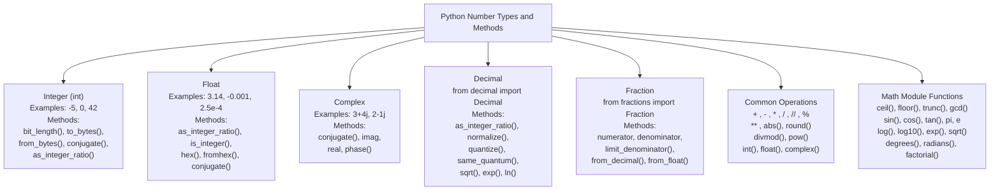
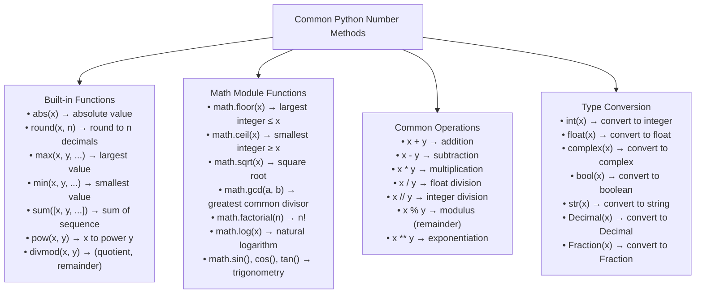

# Number in Python

- [Number in Python](#number-in-python)
  - [See Example from here.](#see-example-from-here)
  - [Why Numbers are important in Python](#why-numbers-are-important-in-python)
  - [Comparison with other data types](#comparison-with-other-data-types)

> In Python, numbers can be represented using several types, including integers, floating-point numbers, and complex numbers. Here's a brief overview:

- Types of Numbers:
    1. **Integers (`int`)**: Whole numbers, positive or negative, without a fractional component (e.g., `5`, `10`, `1000`).
    2. **Floating-Point Numbers (`float`)**: Numbers with a decimal point or in exponential form (e.g., `3.14`, `0.001`, `2.5e2`).
    3. **Complex Numbers (`complex`)**: Numbers with a real and an imaginary part (e.g., `3 + 4j`, `1j`).

- **Immutable**: Numbers are immutable, meaning their value cannot be changed after creation. Any operation that modifies a number creates a new number.
- **Arithmetic Operations**: Python supports standard arithmetic operations like addition (+), subtraction (-), multiplication (*), division (/), and more.
- **Type Conversion**: You can convert between different numeric types using functions like int(), float(), and complex().
- **Mathematical Functions**: Python provides a wide range of mathematical functions through the math module (e.g., sqrt(), sin(), log()).

---

## [See Example from here.](../01_number.py)

## Why Numbers are important in Python

- Numbers are fundamental in Python because they are used in almost every aspect of programming, including:
  - Mathematical calculations and algorithms.
  - Data analysis and scientific computing.
  - Financial calculations and simulations.
  - Game development and graphics.

## Comparison with other data types

- **Lists**: Ordered, mutable collections of elements.
- **Dictionaries**: Key-value pairs for associative data.
- **Strings**: Immutable sequences of characters.
- **Sets**: Unordered collections of unique elements.
- **Numbers**: Represent numeric data (integers, floats, complex numbers).